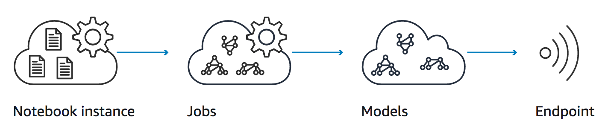
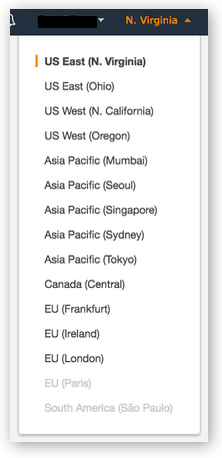
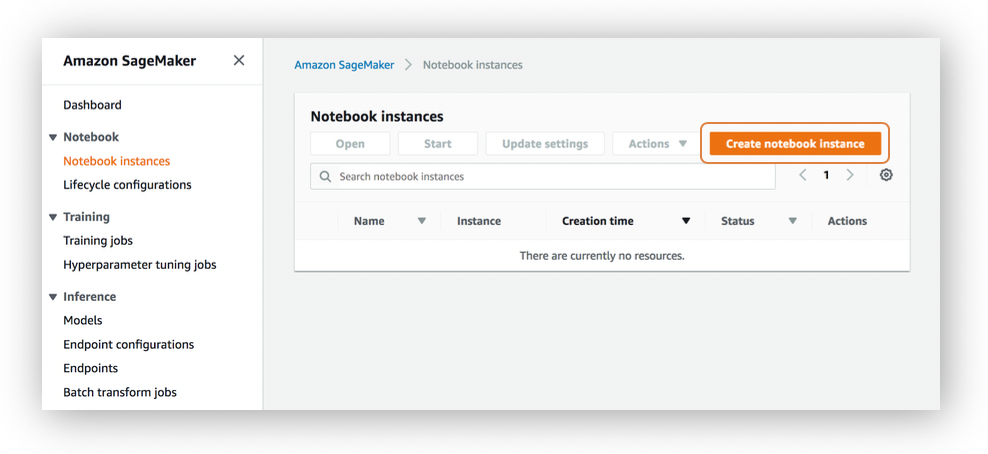
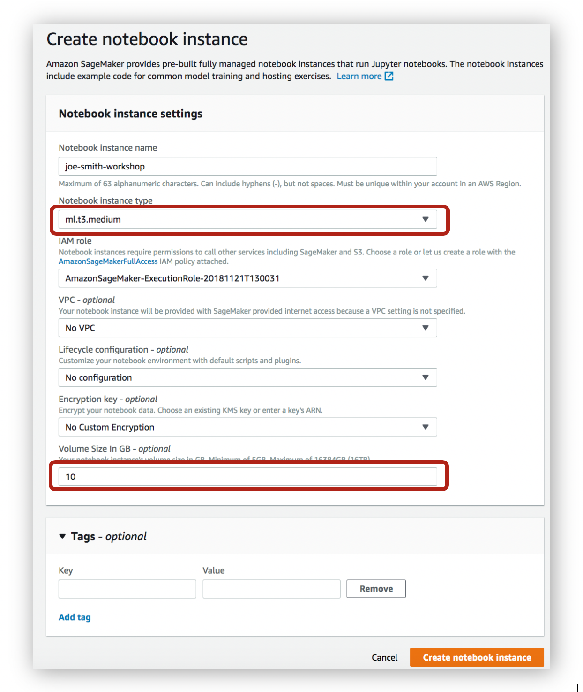
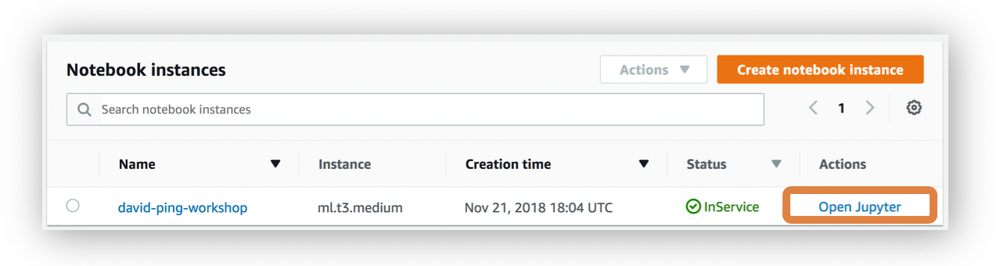
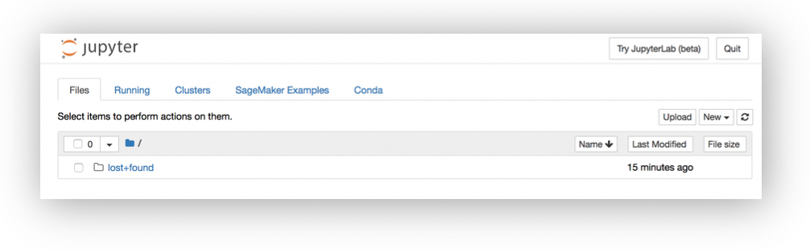
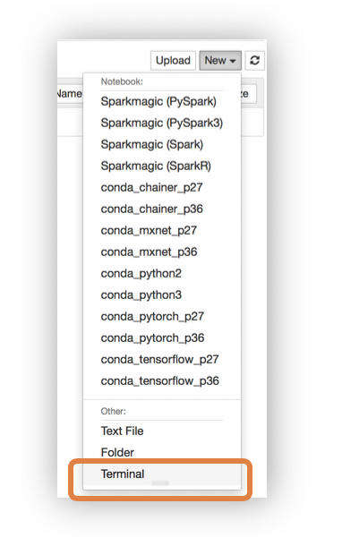

# MXNet and SageMaker Workshop

Apache MXNet is a lean, flexible, and ultra-scalable deep learning framework that supports state of the art in deep learning models, including convolutional neural networks (CNNs) and long short-term memory networks (LSTMs). The framework has its roots in academia and came about through the collaboration and contributions of researchers at several top universities. It has been designed to excel at computer vision, speech, language processing and understanding, generative models, concurrent neural networks, and recurrent neural networks. 

Amazon SageMaker is a fully-managed service that enables developers and data scientists to quickly and easily build, train, and deploy machine learning models at any scale. Amazon SageMaker removes all the barriers that typically slow down developers who want to use machine learning.

This lab is designed to demonstrate how to run the MXNet notebook using Amazon SageMaker, and will introduce the audience to:

-	Launching Jupyter Notebook instance using Amazon SageMaker
-	Hands-on experience with:
    - Multi-Layer Perceptron
	- Convolutional Neural Networks
    - Long Short Term Memory artificial neural networks.

## Prerequisites

### AWS Account

In order to complete this workshop you'll need an AWS Account with access to create AWS IAM, S3, and SageMaker resources. If you do not have an AWS Account, please follow the [instructions here](https://aws.amazon.com/premiumsupport/knowledge-center/create-and-activate-aws-account/) to create an AWS Account.

The code and instructions in this workshop assume only one student is using a given AWS account at a time. If you try sharing an account with another student, you'll run into naming conflicts for certain resources. You can work around these by appending a unique suffix to the resources that fail to create due to conflicts, but the instructions do not provide details on the changes required to make this work.

### AWS Region

SageMaker is not available in all AWS Regions at this time.  Accordingly, we recommend running this workshop in one of the supported AWS Regions such as N. Virginia, Oregon, Ohio.

### Browser

We recommend you use the latest version of Chrome or Firefox to complete this workshop.

## Modules

This workshop is divided into 2 modules. 

1. Creating a Notebook Instance
2. MXNet Labs
    1. Sentiment analysis using MLP
    2. Sentiment analysis using CNN
    3. Sentiment analysis using LSTM

Be patient as you work your way through the notebook-based modules. After you run a cell in a notebook, it may take several seconds for the code to show results. For the cells that start training jobs, it may take 10 to 30 minutes. 

After you have completed the workshop, you can delete all of the resources that were created by following the Cleanup Guide provided with this lab guide. 

## Module 1:  Creating a Notebook Instance 

In this module, we'll start by creating a SageMaker notebook instance, which we will use to run the other workshop modules.

### 1. Launching the Notebook Instance

1. In the upper-right corner of the AWS Management Console, confirm you are in the desired AWS region. Select N. Virginia, Oregon, Ohio.

2. Click on Amazon SageMaker from the list of all services.  This will bring you to the Amazon SageMaker console homepage.

3. To create a new notebook instance, go to **Notebook instances**, and click the **Create notebook instance** button at the top of the browser window.

4. Type [First Name]-[Last Name]-workshop into the **Notebook instance name** text box, and select ml.t3.medium for the **Notebook instance type**.

5. For IAM role, choose **Create a new role**. On the next screen, select **Nones** for the **S3 buckets you specify - optional** section,and click **Create role** to continue.

6. Enter **10** for the **Volume Size In GB - optional** instead of the default 5.

7. You can expand the "Tags" section and add tags here if required.

8. Click **Create notebook instance**.  This will take several minutes to complete.

### 2. Accessing the Notebook Instance

1. Wait for the server status to change to **InService**. This will take a few minutes.

2. Click **Open Jupyter**. You will now see the Jupyter homepage for your notebook instance.

### 3. Download workshop content

1. On the top right corner of the Jupyter Notebook, select **Terminal** from **New** dropdown to open a terminal window.  We will use this terminal to download workshop content from github using git client.

2. Inside the terminal window, type the following commands to download the content. 
 + cd /home/ec2-user/SageMaker
 + git clone https://github.com/dping1/AWS_MXNet_Workshop.git
 

3. Switch back to the Jupyter notebook home tab, you will see a new folder called **AWS_MXNet_Workshop** showed up

## Module 2:  MXNet Labs

Open the AWS_MXNet_Workshop folder, you will see the folllowing notebooks
•	Sentiment_MLP_MXNet.ipynb
•	Sentiment_CNN_MXNet.ipynb
•	time-series-lstm.ipynb

Click each of notebook to start the lab and follow the instructions in each notebook to complete the lab.

## Cleanup Guide

To avoid charges for resources you no longer need when you're done with this workshop, you can delete them or, in the case of your notebook instance, stop them.  Here are the resources you should consider:

- Notebook instance:  you have two options if you do not want to keep the notebook instance running. If you would like to save it for later, you can stop rather than deleting it. To delete it, click the **Notebook instances** link in the left panel. Next, click the radio button next to the notebook instance created for this workshop, then select **Delete** from the **Actions** drop down menu. To simply stop it instead, just click the **Stop** link.  After it is stopped, you can start it again by clicking the **Start** link.  Keep in mind that if you stop rather than deleting it, you will be charged for the storage associated with it.  

## License

The contents of this workshop are licensed under the Apache 2.0 License. 
